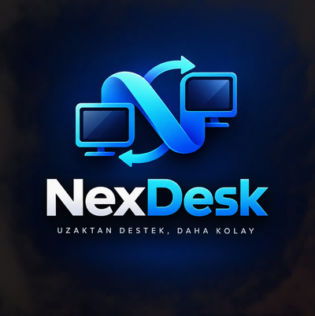

<div align="center">



# NexDesk

### Uzaktan destek, daha kolay.

Windows için **açık, güvenli ve tamamen kullanıcı onaylı** uzak masaüstü destek uygulaması.
Ara sunucuya muhtaç değil, reklam yok, arka planda casusluk yok — sadece iki bilgisayar, bir kod ve uçtan uca şifreli bir bağlantı.

<br/>


</div>

---

## 🎯 NexDesk nedir?

Birine uzaktan yardım etmek çoğu zaman şöyle başlar: *"Şu programı indir, şu hesabı aç, şu izni ver, bu pencereyi kapat..."*

NexDesk bunu kısaltır:

> **Sen kodu ver → o kodu yapıştırır → sen "izin ver" dersin → bağlanırsınız.**

Görüntü de, klavye-fare de, dosyalar da doğrudan iki bilgisayar arasında (peer-to-peer) akar. Ortada verilerinizi gören bir şirket yoktur — **kendi sunucunuzu kurmanıza da gerek yoktur.** Bağlantı kurulduğunda iki tarafta görünen **doğrulama kodunu (SAS)** karşılaştırırsanız araya kimsenin giremeyeceğinden de emin olursunuz.

---

## ✨ Öne çıkan özellikler

| | |
|---|---|
| 🔒 **Uçtan uca şifreli** | Görüntü, kontrol ve dosyalar WebRTC (DTLS) ile şifrelenir. |
| ✅ **Her zaman onaylı** | Kimse sizin "İzin Ver" demeden ekranınıza bağlanamaz. |
| 🛰️ **Her ağdan bağlantı** | Kendi TURN + signaling sunucunuzla (ör. Oracle Cloud ücretsiz katman) 10 haneli kod dünyanın her yerinden çalışır. |
| 🌍 **Sunucusuz yedek yollar** | İnternet kodu (UPnP) ya da 97 karakterlik davet kodu. |
| ⚡ **Akıllı ekran aktarımı** | Yalnızca değişen 64×64 karolar gönderilir; durgun ekran sıfır trafik, yazı yazarken ~35 kat daha az veri. |
| 🧭 **Doğrudan P2P** | STUN ile doğrudan bağlantı; çok katı ağlarda isteğe bağlı TURN. |
| 🛡️ **Dolandırıcılık kalkanı** | Oturumda banka/ödeme sayfası açılırsa görüntü ve kontrol anında durur. |
| 🔑 **SAS doğrulaması** | Tek tıkla karşılaştırma; uyuşmazsa oturum hemen kesilir. |
| 🔁 **Otomatik yeniden bağlanma** | Ağ dalgalanınca oturum geri gelir; yarım kalan dosya **kaldığı yerden** sürer. |
| 🖥️ **Çoklu monitör** | Karşı taraftaki tüm ekranlar arasında geçiş. |
| 🖱️ **Uzak imleç & tıklama efekti** | Teknisyen imleci görür; kullanıcı teknisyenin nereye tıkladığını görür. |
| 📶 **Uyarlamalı kalite** | Ağ gerçekten tıkanınca 720p → 480p'ye iner, açılınca geri çıkar. |
| 🩺 **Bağlantı tanısı** | Bağlanamazsa adresleri, adımları ve olası sebebi (symmetric NAT, UDP engeli, eksik port yönlendirme…) raporlar. |
| 🧰 **Onarım paketi** | DNS, geçici dosyalar, yazıcı kuyruğu, Gezgin, winsock, sfc — tek tık. |
| 🎬 **Oturum video kaydı** | MJPEG AVI olarak kaydedilir; karşı tarafa "KAYIT ALINIYOR" gösterilir. |
| ⏺️ **Makrolar** | Yaptığınız işlemleri kaydedin, sonra tek tıkla tekrar oynatın. |
| 🔄 **Karşılıklı ekran** | Kendi ekranınızı karşı tarafa gösterin (yalnızca izleme). |
| 🤝 **Oturum devri** | Bağlantıyı koparmadan oturumu başka bir teknisyene aktarın. |
| 📇 **Adres defteri** | Etiketler, bilgisayar başına not geçmişi, Wake-on-LAN ile uyandırma. |
| 📁 **Dosya & pano** | Sürükle-bırak dosya, pano paylaşımı, 30 sn'de silinen güvenli pano. |
| 🖊️ **Ekran işaretleme** | Uzak ekrana çizip yol gösterin (çizimler solar). |
| 🕶️ **Gizlilik perdesi & giriş kilidi** | Karşı ekranı karartın, yerel klavye/fareyi geçici kilitleyin. |
| 🎨 **Beyaz etiket** | İsim, slogan, renk ve logoyu kendi markanıza göre değiştirin. |
| 🪶 **Tek dosya** | Kurulum yok. `NexDesk.exe` çalıştır, hazır. Signaling gömülü. |

---

## 🚀 Hızlı başlangıç

### İndir & çalıştır
`dist/NexDesk.exe` dosyasını çalıştırmanız yeterli. Kurulum, .NET, ek paket **yok**.

### Kaynaktan derleme
Go 1.26+ kurulu olmalı:

```powershell
powershell -ExecutionPolicy Bypass -File .\build.ps1
```

Çıktı: `dist\NexDesk.exe` (konsol penceresi olmayan, tek parça GUI uygulaması, gömülü uygulama ikonu).
`assets\nexdesk.ico` değişirse ikon kaynağı (`rsrc_windows_amd64.syso`) derleme sırasında otomatik yenilenir.

---

## 🕹️ Nasıl kullanılır?

<table>
<tr>
<td width="50%" valign="top">

### 🆘 Destek ALAN taraf
1. **"Destek Al"** kartına tıkla.
2. Ekrandaki **kodu** karşı tarafa ilet (**Kopyala** düğmesi var).
3. Bağlantı isteği gelince **"İzin Ver"** de.
4. Ekranın paylaşıldığı sürece üstte kırmızı uyarı görünür; istediğin an **"Bağlantıyı Kes"**.

</td>
<td width="50%" valign="top">

### 🧑‍🔧 Destek VEREN taraf
1. **"Destek Ver"** kartına tıkla.
2. Karşı tarafın **kodunu / internet kodunu / linkini** yapıştır.
3. **"Bağlan"** de, onay bekle.
4. **İşlemler ▾** menüsünden dosya, pano, onarım, kayıt, makro, SAS doğrulama...

</td>
</tr>
</table>

> 💡 **Güvenlik ipucu:** Bağlandıktan sonra **İşlemler ▾ → Güvenlik Kodunu Doğrula (SAS)** ile iki taraftaki 6 haneli kodu karşılaştırın. Aynıysa ✓ işareti çıkar; farklıysa oturum güvenlik için hemen kesilir.

---

## 🌍 Bağlantı yolları

Hangi yol kullanılırsa kullanılsın, kod NexDesk'te **aynı kutuya yapıştırılır**; program türünü kendisi anlar.

| Yol | Ne zaman? | Kod | Nasıl çalışır? |
|---|---|---|---|
| 🛰️ **Sunucu üzerinden (önerilen)** | Her yer, her ağ | `591 490 5011` | Gömülü/ayarlı signaling + TURN sunucusu; doğrudan bağlantı olmazsa trafik şifreli olarak sunucudan aktarılır. |
| 🏠 **Yerel ağ kodu** | Aynı ofis/ev ağı, sunucu yoksa | `591 490 5011` | Gömülü signaling + LAN keşfi. |
| 🌐 **İnternet kodu** | Farklı şehir/ülke, ev modemi | `REQKE-2GZKC-0FZX1-S32WG` | Modemde port **UPnP ile otomatik** açılır, dış IP koda gömülür. |
| ✉️ **Davet kodu** | UPnP yok, kurumsal ağ, CGNAT | `DAVET-…` / `YANIT-…` (97 karakter) | Tamamen sunucusuz iki adımlı el sıkışma. |

### 🌐 İnternet kodu
- "Destek Al" sayfasında kod oluşunca NexDesk modemde portu açar ve dış IP'yi öğrenir.
- 20 karakterlik kod **IP + port + oturum kodunu** taşır; içinde doğrulama hanesi olduğu için yanlış yazılan kod reddedilir, O/0 ve I/L/1 karışıklığı kendiliğinden düzeltilir.
- Oturum bitince modemde açılan port kapatılır.
- **Çalışmadığı durumlar** ekranda açıklanır: modemde UPnP kapalıysa 8091/TCP elle yönlendirilmelidir; operatör paylaşımlı IP (CGNAT) kullanıyorsa bu yol ulaşamaz → **davet kodunu** kullanın.

### ✉️ Davet kodu (sunucusuz el sıkışma)
1. **Destek veren:** "Destek Ver" → **Sunucusuz Bağlan (davet kodu)**. Kod ekranda seçilebilir kutuda çıkar ve panoya kopyalanır → karşıya gönderin.
2. **Destek alan:** "Destek Al" → **Davet Kodunu Yapıştır** → onay verir → ekranda bir **YANIT** kodu çıkar → geri gönderir.
3. **Destek veren** yanıtı yapıştırır → doğrudan bağlantı kurulur.

Kod yalnızca yeniden üretilemeyen bilgileri taşır: DTLS parmak izi (tam 32 bayt — güvenlik kısaltılmadı), ICE kimliğinin türetildiği kısa bir tohum ve en fazla 5 adres.

> ℹ️ Dış IP'yi öğrenmek için ücretsiz servisler (ipify vb.) ve Google STUN kullanılır; **veri bu servislerden geçmez**. İki taraf da çok katı ağdaysa (symmetric NAT) doğrudan bağlantı kurulamaz; **Ayarlar → TURN** alanını kullanın.

---

## 🛰️ Kendi sunucunuz (TURN + signaling)

Kurumsal ağlar ve mobil operatörler çoğunlukla **symmetric NAT** kullanır; bu durumda iki bilgisayar arasında doğrudan bağlantı **hiçbir yöntemle** kurulamaz. Çözüm, trafiği şifreli olarak aktaran küçük bir sunucudur. Gereken her şey `sunucu/` klasöründe:

| Dosya | Açıklama |
|---|---|
| `sunucu/sunucu-kur.sh` | Ubuntu 22.04/24.04 için tek komutluk kurulum: **coturn** (TURN) + **NexDesk signaling** (systemd servisi), port kontrolü, ufw/iptables kuralları, rastgele TURN parolası. |
| `sunucu/nexdesk-signaling` | Linux için derlenmiş signaling sunucusu (depoda yok; aşağıdaki komutla üretin). |

```powershell
$env:GOOS='linux'; $env:GOARCH='amd64'; $env:CGO_ENABLED='0'
go build -trimpath -ldflags='-s -w' -o sunucu\nexdesk-signaling ./cmd/signaling
```

### Oracle Cloud ücretsiz katmanla 10 dakikada kurulum
1. **cloud.oracle.com** → ücretsiz hesap. *Home region* sonradan değişmez; Türkiye'ye yakın bir Avrupa bölgesi seçin (Frankfurt/Amsterdam).
2. **Compute → Instances → Create:** Ubuntu 22.04, shape **VM.Standard.E2.1.Micro** (*Always Free*), SSH anahtarını indirin.
3. Instance oluşunca public IP yoksa: VNIC → IP administration → Edit → **Ephemeral public IP**.
4. **Subnet → Security List → Add Ingress Rules** (kaynak `0.0.0.0/0`): TCP 8091, UDP 3478, TCP 3478, UDP 49160-49200.
5. Dosyaları gönderip kurun:
   ```bash
   scp -i anahtar.key sunucu/sunucu-kur.sh sunucu/nexdesk-signaling ubuntu@SUNUCU_IP:~/
   ssh -i anahtar.key ubuntu@SUNUCU_IP "sed -i 's/\r$//' sunucu-kur.sh && sudo bash sunucu-kur.sh"
   ```
6. Betiğin yazdığı değerleri NexDesk'e verin (aşağıda).

> Kendi sunucunuz (ör. kurum içi bir Ubuntu) da olur; o zaman güvenlik duvarında TCP 8091, UDP/TCP 3478 ve UDP 49160-49200 bu makineye yönlendirilmeli (çıkışta port değiştirmeyen **statik NAT** ile).

### Sunucu ayarlarını NexDesk'e verme
- **Exe'ye gömmek (önerilen):** `cmd/remotesupport/assets/server-defaults.local.json` oluşturun (git'e girmez) ve derleyin:
  ```json
  {
    "signaling_url": "ws://SUNUCU_IP:8091/v1/ws",
    "turn_url": "turn:SUNUCU_IP:3478?transport=tcp",
    "turn_user": "nexdesk",
    "turn_pass": "betiğin-ürettiği-parola"
  }
  ```
  Ayarlar sayfasındaki alanlar boş kaldıkça gömülü sunucu kullanılır; kullanıcı kendi değerini girerse o geçerlidir. Gömülü sunucuya ulaşılamazsa NexDesk yerel ağ signaling'ine döner.
- **Elle:** Ayarlar → *İnternet Signaling* ve *TURN* alanları. Birden fazla adres virgülle girilebilir (ör. dış + iç adres); ulaşılabilen ilki kullanılır.

> ⚠️ Gömülü TURN parolası exe'nin içindedir. Exe'yi ele geçiren biri sunucunuzu aktarma için kullanabilir (görüntüler yine uçtan uca şifreli kalır, iç ağa köprü kurulamaz). Kurum dışına dağıtacaksanız bunu göz önünde bulundurun. `server-defaults.local.json` dosyasını **asla** depoya göndermeyin.

---

## ⚡ Ekran aktarımı nasıl çalışır?

- Ekran 64×64'lük karolara bölünür; her karede **yalnızca değişen karolar** tek bir JPEG "atlas" içinde gönderilir, konumları JPEG yorum segmentinde taşınır.
- Ekran değişmiyorsa **hiç veri gitmez**; 5 saniyede bir ve büyük değişimlerde tam kare gönderilir.
- Yeni kare yalnızca ağ bir öncekini teslim ettiğinde üretilir (geri basınç): hat yavaşsa görüntü gecikmez, kare atlanır.
- Uzun hatlar için WebRTC veri kanalı alma penceresi 8 MB'a çıkarıldı; ölçekli (%125/%150) ekranlar gerçek piksel olarak yakalanır.
- Uyarlamalı kalite, destek alan tarafta "ağ önceki kareyi yetiştirebildi mi?" ölçüsüyle çalışır.
---

## 🧰 Oturum içi araçlar (İşlemler ▾)

| Araç | Açıklama |
|---|---|
| **Dosya Gönder / sürükle-bırak** | Dosyaları pencereye bırakın. Bağlantı koparsa aktarım yeniden bağlanınca **kaldığı yerden** sürer. |
| **Panoyu Gönder / Al** | Metin panosu iki yönlü. |
| **Panoyu Güvenli Gönder** | Karşıda pano geçmişine yazılmaz, 30 sn sonra silinir (şifre vb. için). |
| **Onarım Paketi** | DNS önbelleği, geçici dosyalar, yazıcı kuyruğu, Gezgin, winsock, sfc. Bazıları karşı tarafta yönetici yetkisi ister. |
| **Uzak Sistem Bilgisi** | Bilgisayar, bellek, disk özeti. |
| **Ekran Görüntüsü (F12)** | İndirilenler klasörüne kaydeder. |
| **İşaretleme Modu** | Uzak ekrana çizim. |
| **Oturumu Video Kaydet** | `Videolar\NexDesk\*.avi` — karşı tarafa kayıt uyarısı gösterilir. |
| **Makrolar** | Kaydet → adlandır → listeden tek tıkla oynat. |
| **Ekranımı Karşı Tarafa Göster** | Sizin ekranınız karşıda ayrı pencerede, yalnızca izleme. |
| **Oturumu Devret** | Karşı taraf onaylarsa yeni kod üretilir; yeni teknisyen bağlanınca sizin oturumunuz kapanır. |
| **Bu Bilgisayara Not Ekle** | Not geçmişi, aynı bilgisayara bir sonraki bağlantıda otomatik gösterilir. |
| **Bağlantı Günlüğü** | Kopmalar, yeniden bağlanmalar, kalite değişimleri, SAS olayları. |
| **Gizlilik Perdesi / Giriş Kilidi** | Karşı ekranı karart / yerel girişi kilitle. |

---

## 📇 Bağlantılar sayfası (adres defteri)

Sol menüdeki **Bağlantılar** sayfası, oturum kurduğunuz her bilgisayarı otomatik kaydeder:

- 🔎 Ad, etiket veya bilgisayar adına göre arama
- 🏷️ Görünen ad ve etiketler (müşteri, şube, konum…)
- 📝 Bilgisayar başına tarihli not geçmişi
- ⏰ **Uyandır (WoL):** MAC adresi, o bilgisayar bir kez destek alan taraf olduğunda öğrenilir; aynı ağda kapalı makineyi açar.

---

## 🔐 Güvenlik felsefesi

NexDesk, "kötüye kullanılamayacak" bir destek aracı olacak şekilde tasarlandı:

- 🙅 **Sessiz/gizli bağlantı yok.** Her oturum karşı tarafın açık onayıyla başlar; gizli çalışma, kendiliğinden başlama ya da kalıcılık yoktur.
- 👁️ **Görünür durum.** Ekranı paylaşılan tarafta kalıcı "paylaşılıyorsunuz" uyarısı, kayıt sırasında "KAYIT ALINIYOR" işareti vardır.
- ✋ **Her an kesilebilir.** Tek tıkla bağlantı sonlanır.
- 🔑 **SAS doğrulaması.** Ortadaki-adam saldırılarına karşı; uyuşmazlıkta oturum otomatik kesilir.
- 🛡️ **Dolandırıcılık kalkanı.** Oturum sırasında banka, e-Devlet, kripto borsası veya ödeme sayfası öne gelirse görüntü ve uzaktan kontrol durur; kullanıcıya *"sizi arayan kişi kendini banka/polis olarak tanıttıysa bu dolandırıcılık olabilir"* uyarısıyla bağlantıyı kesme seçeneği sunulur (varsayılan: **kes**).
- 🧱 **Rol koruması.** Kontrol mesajları yalnızca doğru tarafta kabul edilir; destek alan taraf, teknisyenin bilgisayarını yönetemez ya da kilitleyemez.
- 🧯 **Güvenlik duvarı izni yalnızca onayla.** "Destek Al" ilk kez açıldığında NexDesk, Windows Güvenlik Duvarı'na kural eklemek için kullanıcıya sorar ve UAC onayı ister; sessizce kural eklemez.
- 🔒 **Güvenli masaüstüne saygı.** Ctrl+Alt+Del, UAC ve kilit ekranı sırasında paylaşım bekler, teknisyene bildirilir; kullanıcı kapatınca kendiliğinden devam eder.
- ⏱️ **Boşta kalma koruması.** Uzun süre işlem olmazsa uyarır (isteğe bağlı otomatik kesme).
- 📜 **Denetim kaydı.** Bağlantı, onay, onarım ve kayıt olayları yerel günlüğe yazılır.

---

## 🎨 Beyaz etiket (kurumsal marka)

NexDesk'i kendi firmanızın uygulamasıymış gibi dağıtabilirsiniz. Ayar klasörüne
(`%APPDATA%\RemoteSupport\`) bir `branding.json` bırakmanız yeterli:

```json
{
  "name": "Firma Destek",
  "tagline": "Bir tık uzağınızdayız",
  "author": "Firma A.Ş.",
  "accent": "2E90FF",
  "logo_path": "C:\\firma\\logo.png"
}
```

| Alan | Anlamı |
|------|--------|
| `name` | Uygulama adı (başlık, üst bar, hakkında). |
| `tagline` | Slogan. |
| `author` | Alt bilgide görünen "Program Yazarı". |
| `accent` | Vurgu rengi (6 haneli HEX, `#` opsiyonel). |
| `logo_path` | Özel PNG logo yolu (boşsa gömülü NexDesk logosu). |

Dosya yoksa varsayılan **NexDesk** kimliği kullanılır.

---

## 🗂️ Yerel veriler

Hepsi `%APPDATA%\RemoteSupport\` altında, yalnızca bu bilgisayarda tutulur:

| Dosya | İçerik |
|---|---|
| `settings.json` | Ayarlar (signaling, TURN, kalite, boşta kalma). |
| `addressbook.json` | Adres defteri, etiketler, notlar, MAC adresleri. |
| `recent.json` | Son bağlantılar. |
| `netlog.log` | Bağlantı / kesinti günlüğü (2 MB'da döner). |
| `audit.log` | Denetim kaydı. |
| `macros\*.json` | Kayıtlı makrolar. |
| `crash.log` | Yakalanan hatalar. |

> Sorun ayıklarken `NEXDESK_DEBUG=1` ortam değişkeniyle başlatılırsa tüm durum mesajları da `netlog.log`'a yazılır.

Video kayıtları `Videolar\NexDesk\`, alınan dosyalar ve ekran görüntüleri `İndirilenler` klasörüne gider.

---

## 🧩 Mimari

```
┌───────────────┐   1) kod: yerel / internet / davet     ┌───────────────┐
│  Destek ALAN  │  ───────────────────────────────────▶  │ Destek VEREN  │
│   (target)    │                                         │  (operator)   │
│               │   2) tanışma: gömülü signaling (LAN,    │               │
│  ekranı yayar │      UPnP) ya da davet/yanıt kodu       │ ekranı görür  │
│               │                                         │               │
│               │   3) P2P WebRTC (DTLS, şifreli)         │               │
│  ctl │ file   │  ◀═════════════════════════════════▶    │  ekran │ ctl  │
│  screen ch.   │      görüntü · kontrol · dosya          │  file ch.     │
└───────────────┘                                         └───────────────┘
```

- **Signaling** yalnızca iki tarafı tanıştırır; oturum verisi taşımaz. `NexDesk.exe` içine gömülüdür ya da kendi sunucunuzda çalışır. Davet kodu yolunda hiç kullanılmaz.
- **TURN** yalnızca doğrudan bağlantı kurulamadığında devreye girer ve şifreli trafiği olduğu gibi aktarır; içeriği göremez.
- Kodlar **tek kullanımlık** ve **kısa ömürlüdür**.
- Ekran yakalama GDI `BitBlt` (imleç dahil), arayüz ham Win32 (owner-draw, çift tamponlu çizim) — ağır UI çatısı yok.

### 📂 Proje yapısı

```
RemoteSupport/
├─ cmd/
│  ├─ remotesupport/            # GUI istemci (ana uygulama)
│  │  ├─ app.go                 #   giriş noktası, pencere kurulumu
│  │  ├─ main.go                #   sabitler, Win32 bağları
│  │  ├─ session.go             #   oturum akışı (agent / operator)
│  │  ├─ network.go             #   ekran yayını, gömülü signaling, LAN keşfi
│  │  ├─ viewer.go              #   uzak ekran görüntüleyici
│  │  ├─ remote_input.go        #   kontrol mesajları, girdi enjeksiyonu, dosya alma
│  │  ├─ commands.go            #   menüler, komutlar, pencere yordamı
│  │  ├─ paint.go · ui_*.go     #   arayüz çizimi ve yerleşim
│  │  ├─ b1_*.go                #   onarım, SAS, pano, adres defteri, WoL, günlük
│  │  ├─ b2_*.go                #   kalkan, devir, karşılıklı ekran, kayıt, makro
│  │  ├─ b3_net.go              #   internet kodu + UPnP
│  │  ├─ b3_manual.go · b3_compact.go  # sunucusuz davet kodu
│  │  ├─ b3_defaults.go         #   gömülü sunucu ayarları (+ .local.json)
│  │  ├─ b3_firewall.go · b3_diag.go   # güvenlik duvarı izni · bağlantı tanısı
│  │  ├─ b4_tiles.go            #   karo/delta ekran kodlama
│  │  ├─ qr.go                  #   bağımsız QR kod üretici
│  │  └─ assets/                #   logo.png, nexdesk.ico
│  ├─ signaling/                # tek başına signaling sunucusu (opsiyonel)
│  └─ capture-check/            # ekran yakalama testi
├─ client/                      # capture · screen · signaling · webrtc
├─ server/signaling/            # rendezvous/signaling sunucu mantığı
├─ shared/                      # protokol · uçtan uca yardımcılar
├─ sunucu/                      # sunucu-kur.sh (coturn + signaling kurulumu)
└─ build.ps1                    # tek komutla derleme (ikon kaynağı dahil)
```

---

## 🤝 Katkı

Fikir, hata bildirimi ve PR'lara açığız! Bir hata mı buldunuz, bir özellik mi hayal ettiniz — issue açmaktan çekinmeyin.

---

## 📜 Lisans

MIT Lisansı altında dağıtılır. Dilediğiniz gibi kullanın, geliştirin, paylaşın.

---

<div align="center">

**Program Yazarı: Hasan Güler** · © 2026

*Uzaktan destek, daha kolay.* 💙

</div>
